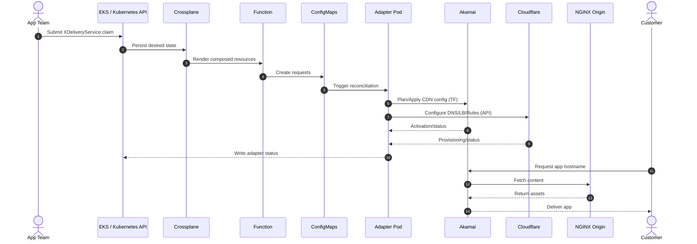
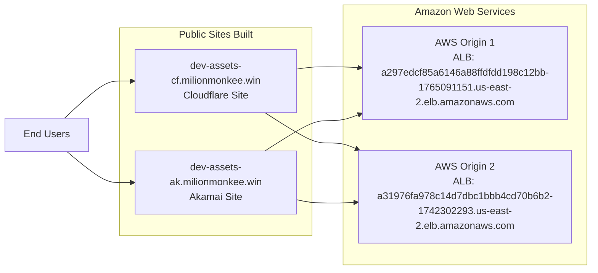

# Demo Runbook

## CDN Endpoints
http://dev-assets-ak.milionmonkee.win/
http://dev-assets-cf.milionmonkee.win/

## AWS ALB urls
http://a297edcf85a6146a88ffdfdd198c12bb-1765091151.us-east-2.elb.amazonaws.com/healthz
http://a297edcf85a6146a88ffdfdd198c12bb-1765091151.us-east-2.elb.amazonaws.com/static/mdemo.html
http://a297edcf85a6146a88ffdfdd198c12bb-1765091151.us-east-2.elb.amazonaws.com/s.svg
http://a297edcf85a6146a88ffdfdd198c12bb-1765091151.us-east-2.elb.amazonaws.com/static/newpage.html

http://a31976fa978c14d7dbc1bbb4cd70b6b2-1742302293.us-east-2.elb.amazonaws.com/healthz
http://a31976fa978c14d7dbc1bbb4cd70b6b2-1742302293.us-east-2.elb.amazonaws.com/static/mdemo.html
http://a31976fa978c14d7dbc1bbb4cd70b6b2-1742302293.us-east-2.elb.amazonaws.com/s.svg
http://a31976fa978c14d7dbc1bbb4cd70b6b2-1742302293.us-east-2.elb.amazonaws.com/static/newpage.html

## Story

One Crossplane claim defines a digital static-assets service. The platform composes:
- an Akamai request handled through Terraform
- a Cloudflare request handled through native APIs
- internal DNS, certificate, and identity requests

## apply command
WATCH_LOGS=true bash 12-apply-env-claim.sh dev v1

## Rollback command
WATCH_LOGS=true bash 14-rollback-env.sh dev v1

## decomission command
WATCH_LOGS=true bash 13-decommission-env.sh dev


## End-to-End Flow (Leadership View)


##  Network Diagram



## Demo order

```bash
bash scripts/01-bootstrap-crossplane.sh
bash scripts/06-build-adapter-image.sh
kubectl apply -f manifests/adapters/adapter-secret-example.yaml
bash scripts/07-deploy-adapters.sh
bash scripts/02-install-demo.sh
bash scripts/10-deploy-observability.sh
bash scripts/03-deploy-web.sh
bash scripts/05-inspect-demo.sh
bash scripts/04-get-demo-url.sh
```

## Manager FAQ Answers

### 1) How do we make revisions to an existing configuration?

Apply a new claim revision manifest for the same `metadata.name`:

```bash
bash scripts/08-apply-claim-revision.sh v2
```

This updates the existing `XDeliveryService` and Crossplane reconciles both CDNs + integrations to the new intent.

### 2) How do we roll back changes?

Roll back by applying the prior known-good claim revision:

```bash
bash scripts/09-rollback-claim.sh
```

This reapplies `v1` and Crossplane reconciles back to the previous desired state.

### 3) How do we version control claims and claim changes?

- Keep claims under `manifests/demo/revisions/`.
- Use one file per revision (`static-assets-claim-v1.yaml`, `static-assets-claim-v2.yaml`).
- Track changes in Git with commits/tags and use PR review for approvals.
- Keep a `milionmonkee.win/claim-revision` label for quick cluster-side visibility.

### 4) Show slightly different caching rules

`v1` and `v2` differ intentionally:
- `v1`: `cacheTtlSeconds: 3600`, `htmlCachePolicy: inherit`
- `v2`: `cacheTtlSeconds: 120`, `htmlCachePolicy: no-store`

For Cloudflare, `no-store` adds a no-cache HTML rule while keeping static asset cache rules.

### Terraform variables (Akamai) configuration

Terraform variables are rendered from the claim by the Composition into the Akamai request `ConfigMap`.
You can control the Akamai activation target directly from the claim:

- `akamaiNetwork: STAGING` for staging activation
- `akamaiNetwork: PRODUCTION` for production activation

Current revision examples:
- `manifests/demo/revisions/static-assets-claim-v1.yaml` -> `STAGING`
- `manifests/demo/revisions/static-assets-claim-v2.yaml` -> `STAGING`

### 5) Have a load balancer in place

The claim includes `runtimeAlbHost` and `secondaryOriginHost`, and Cloudflare adapter creates/uses a load balancer path when a secondary origin is present.

### 6) Can we send only logs from namespaces that matter?

Yes. Fluent Bit is configured to forward only:
- `crossplane-system`
- `multi-cdn-demo`

Deploy with:

```bash
bash scripts/10-deploy-observability.sh
```

See details in `docs/OBSERVABILITY.md`.

## Can we deliver the demo HTML using the endpoint?

Yes. The NGINX service is exposed as `multi-cdn-demo-web` and `scripts/04-get-demo-url.sh` prints the endpoint hostname/IP.
Open `http://<endpoint>` in the browser to show the demo HTML.

## Talking points

- The platform team owns the `XDeliveryService` API and Composition.
- Application teams submit one claim instead of touching CDN vendor systems directly.
- The claim drives both CDNs at once: Akamai through Terraform and Cloudflare through native APIs.
- Internal control points such as DNS, certificates, and identity are composed in the same workflow.
- Adapter status ConfigMaps make the external execution steps visible inside the cluster.
